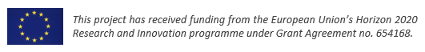

DDDigi: The digitization tools of DD4hep
========================================

`DDDigi` is supposed to interprete the results of the detector simulation phase
e.g. using the simulation toolket [DDG4](../DDG4) with its command line interface
[ddsim](../DDG4/python/DDSim).
This is the final phase of data processing to obtain data from the simulation 
branch which are as close as possible to the response of the front-end electronics
of a real experimental setup.

The simulation phase ejects for all subdetectors and the individual 
sensitive elements contained the energy deposits created by particles from a 
primary interaction passing the sensitive volume.
These data have to processed for taking into accound imperfections of the 
apparatus such as 

- uncertainties in cable lengths resulting in shifts of time of signal arriving.
- uncertainties in the position of sensitive volumes.
- dead or hot readout channels.
- conversion of the final signal data into the equivalent of ADC counts.
- ...


This detector design has been pulled from , and was originally developed in
[ATHENA](https://eicweb.phy.anl.gov/EIC/detectors/athena), for the Electron-Ion Collider.


To use `ctest`, run:
```bash
cd ..  # `pwd` should now be `DD4hep/examples`
mkdir build
cd build
cmake -DDD4HEP_EXAMPLES="OpticalTracker" .. && make && make install
ctest --output-on-failure   # or use `--verbose` to see all output
```



