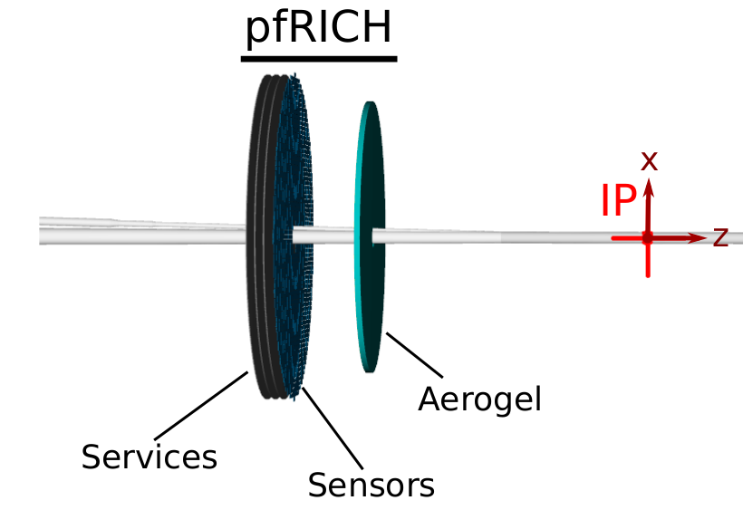

Proximity Focusing RICH
=======================

Example RICH demonstrating `Geant4OpticalTracker` Sensitive Detector plugin usage.

This detector design has been pulled from [ePIC](https://github.com/eic/epic), and was originally developed in
[ATHENA](https://eicweb.phy.anl.gov/EIC/detectors/athena), for the Electron-Ion Collider.



For testing, it is recommended to follow `../README.md` and use `ctest`. See below for guidance for
running this example standalone.

To use `ctest`, run:
```bash
cd ..  # `pwd` should now be `DD4hep/examples`
mkdir build
cd build
cmake -DDD4HEP_EXAMPLES="RICH" .. && make && make install
ctest --output-on-failure   # or use `--verbose` to see all output
```

## Local Development
If you want to run this example standalone, without needing to run `ctest`,
make a standalone build. The following assumes that your current working
directory is `DD4hep/examples/RICH`.

Build with `cmake`, for example:
```bash
cmake -B build -S . -D CMAKE_INSTALL_PREFIX=install
cmake --build build -- install
```

Run a test simulation:
```bash
install/bin/run_test_RICH.sh \
  python install/examples/RICH/scripts/richsim.py
```
- See default settings in `scripts/richsim.py`
- Override these settings, or add additional settings by appending `ddsim` options

Draw the hits, to show Cherenkov photon rings:
```bash
root sim.root
```
```cpp
// In ROOT interpreter:
EVENT->Draw("PFRICHHits.position.Y():PFRICHHits.position.X()"); // hit positions
EVENT->Draw("@PFRICHHits.size()");                              // raw number of hits per event
```

Test for the expected number of hits:
```bash
root -b -q -l scripts/test_number_of_hits.C
```
